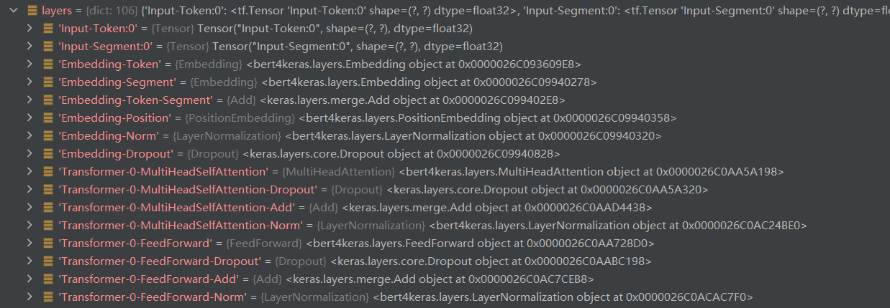
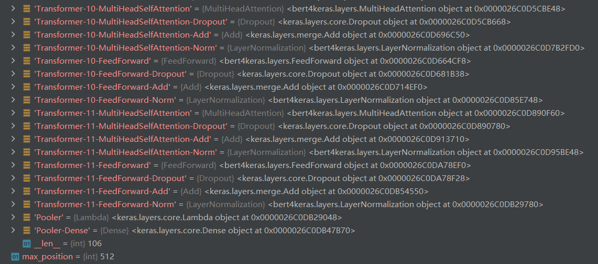
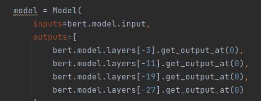
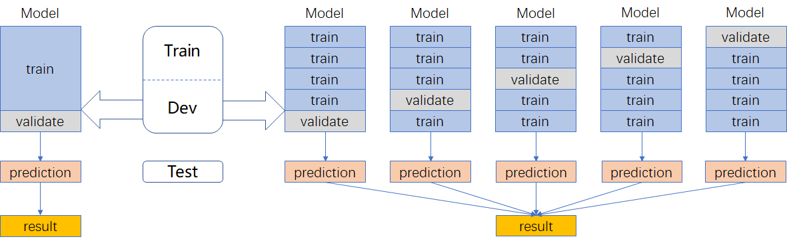

# # 补充说明文档

## 1. 数据说明

训练集数据共有：8747条

验证集数据共有：2002条

删除后的训练集数据共有：8747条（没有缺失数据）

额外的训练集数据共有：20000条

原训练集数据与额外训练集数据拼接后共有：28747条

> 使用的额外数据为：2019年平安医疗科技疾病问答迁移学习比赛（chip2019）
>
> chip2019数据下载：https://www.biendata.xyz/competition/chip2019/data/
> chip2019的train.csv 包含2万对人工标注好的疾病问答数据，由5个病种构成，其中diabetes 10000条，hypertension、hepatitis、aids、breast__cancer各2500条，共计20000条。

## 2. 数据生成器

- 定义训练步数：所有的数据样本数 // batch_size，如果余数不为0，步数加1

- 对数据进行了shuffle（可设置是否进行shuffle），对数据进行遍历，先对数据进行encode编码，将编码后的结果存放到 list 中（token_ids，segment_ids，batch_labels），判断数据样本数是否是batch_size的倍数或者遍历到了最后一条数据，就对一个 batch 中的数据进行补长操作，并使用 yield 返回（减少内存占用）

- 定义forfit函数，进行迭代生成

## 3. 模型结构

模型结构的改进：

第一种：使用最后一层的【CLS】作为输出，维度为768

第二种：使用最后四层的【CLS】拼接后作为输出，维度为3072维

第三种：使用最后一层的【Pool】作为输出，维度为768

**作者表示实际使用差别不大，第一种又好又简单。**

对 bert 的输出先过一层 dropout(0.2)，再经过全连接 (激活函数为softmax)

模型编译：损失为二分类交叉熵损失，优化器为Adam(1e-5)，评估指标为 ‘accuracy’

补充：Bert 中 layer共106部分，前面8个模块为 Input 和 Embedding，12层：12 * 8，96个模块，最后面2个模块为Pooler 和 Pooler-Dense，共计106个模块。

MulitiHeadAttention —> Dropout —> Add —> LayerNormalization —> FeedForward —> Dropout —> Add —> LayerNormalization —> Pooler —> Pooler-Dense

因此，代码中是将最后四层的【CLS】取出来。

## 4. 对抗训练

model是需要添加对抗训练的keras模型，embedding_name则是model里边Embedding层的名字。要在模型compile之后使用。

## 5. 模型训练

采用5折交叉验证

先将训练集和验证集的数据先通过 concatenate 函数拼接起来，然后再进行5折划分，其中4折作为训练集，1折作为测试集进行训练，训练过程中加入了对抗训练和早停机制（如果训练一个batch验证集效果不提升就停止训练）。

## 6. 模型融合

代码中使用了三种模型

| 模型               | 特点                       | 权重 | 加入外部句对数据 |
| ------------------ | -------------------------- | ---- | ---------------- |
| BERT-wwm-ext       | 全词Mask                   | 1    | YES              |
| Ernie-1.0          | 对词、实体及实体关系建模   | 1    | YES              |
| RoBERTa-large-pair | 面向相似性或句子对任务优化 | 1    | NO               |

模型文件下载地址如下：

BERT-wwm-ext：https://drive.google.com/u/0/uc?id=1buMLEjdtrXE2c4G1rpsNGWEx7lUQ0RHi&export=download

Ernie-1.0：https://github.com/ArthurRizar/tensorflow_ernie

RoBERTa-large-pair：https://drive.google.com/u/0/uc?id=1ykENKV7dIFAqRRQbZIh0mSb7Vjc2MeFA&export=download

注意：

**训练阶段：**

使用Adam优化器，早停机制，每个模型每一折跑5个epoch，以 ‘val_loss’ 为评估准则，取最好的结果保存权重。

| 模型                  | LR   | DR   | batch | fold_1 | fold_2 | fold_3 | fold_4 | fold_5 |
| --------------------- | ---- | ---- | ----- | ------ | ------ | ------ | ------ | ------ |
| bert                  | 1e-5 | 0.2  | 16    | 0.9516 | 0.9488 | 0.9470 | 0.9167 | 0.9418 |
| bert + ext(额外数据)  | 1e-5 | 0.2  | 16    | 0.8979 | 0.9003 | 0.9042 | 0.8971 | 0.8935 |
| ernie                 | 1e-5 | 0.2  | 16    | 0.9553 | 0.9409 | 0.9502 | 0.9293 | 0.9428 |
| ernie + ext(额外数据) | 1e-5 | 0.2  | 16    | 0.8992 | 0.9093 | 0.9046 | 0.9075 | 0.9070 |
| roberta               | 1e-6 | 0.2  | 8     | 0.9153 | 0.8935 | 0.7679 | 0.9014 | 0.8944 |

预测阶段：

使用训练阶段保存的模型文件，对测试集进行预测，将结果进行反sigmoid函数化（用反函数取出sigmoid/softmax归一化之前的状态做平均，信息量更大，提升明显），注意代码中反sigmoid函数化使用了两次，先是在同等模型不同权重间使用，随后又在不同模型间使用，并设置了分类阈值为0.47，得到res；

然后将res作为为测试集的伪标签，把训练集和测试集进行拼接，再使用bert模型进行训练，和训练阶段的区别在于调小了学习率为1e-6，使用早停机制训练5个epoch后，对测试集再进行预测，得到结果pred_pl；

最终将res和pred_pl进行加权融合，得到最后的结果。